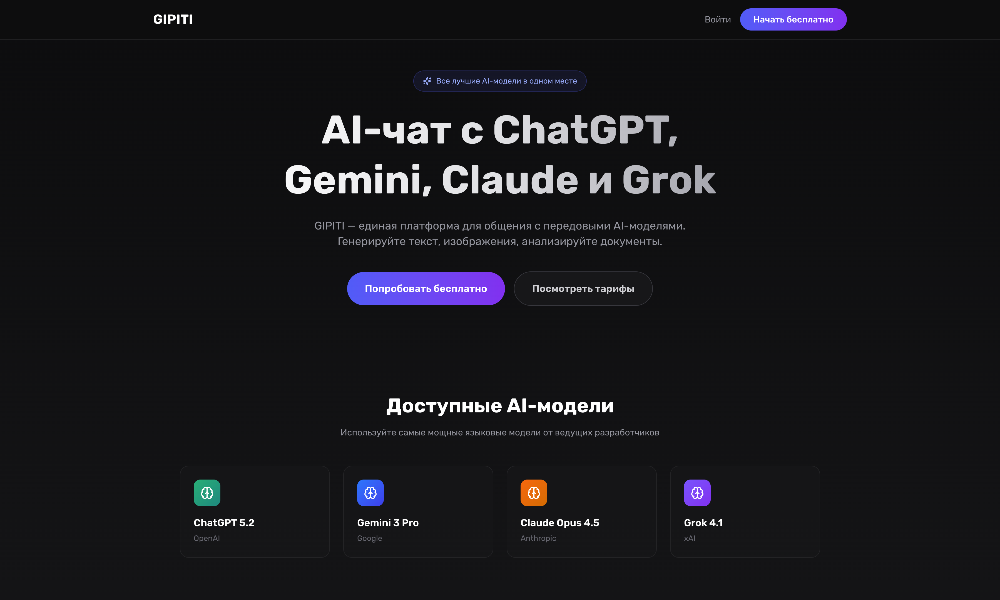
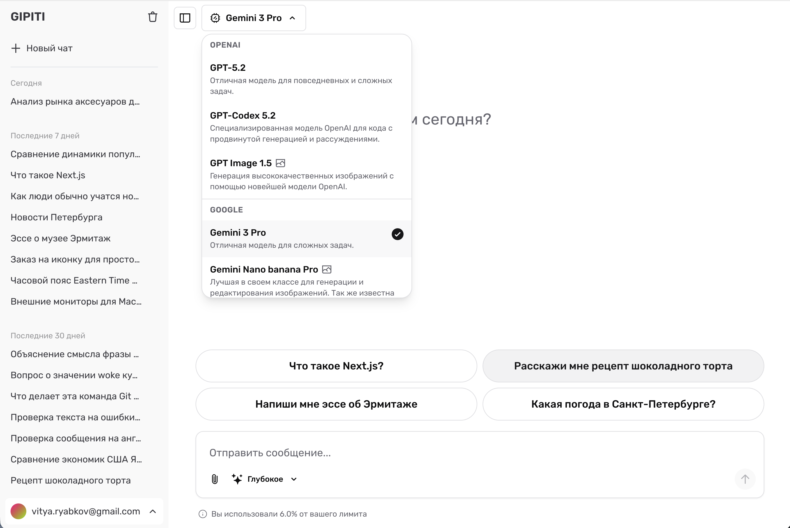
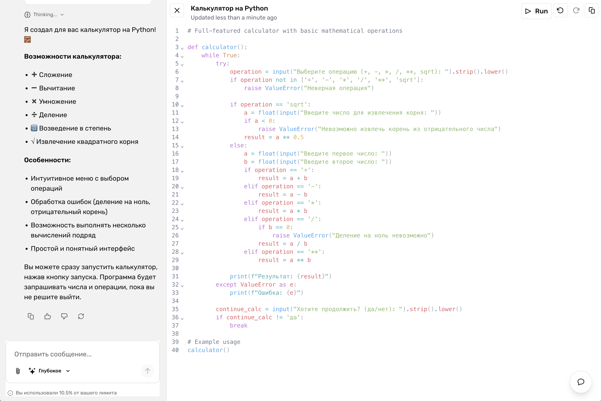
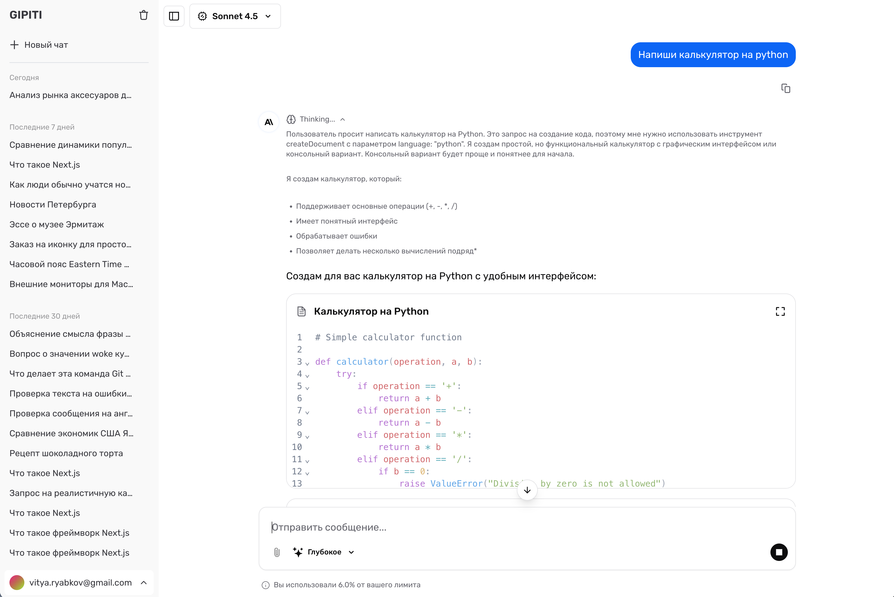

<h1 align="center">Gipiti</h1>

  <strong>One interface. Multiple AI providers. Unlimited creativity.</strong>

  Chat with GPT-5, Claude, Gemini, and Grok — all in one place. 
  Create documents, code, spreadsheets, and images without leaving the conversation.

  <a href="https://gipiti.ru"><strong>Try Gipiti</strong></a>

 

<!-- Screenshot placeholder -->

  
   
  <em>Your AI conversation hub</em>

 

## Why Gipiti?

Tired of switching between ChatGPT, Claude, and other AI tools? Gipiti brings them all together in one beautiful interface. Pick the best model for each task, create rich documents on the fly, and never lose a conversation again.

 

## Key Features

| | Feature | Description |
|---|---------|-------------|
| 🤖 | **Multi-Model Chat** | Switch between 14+ AI models from OpenAI, Anthropic, Google, and xAI |
| 🧠 | **Extended Thinking** | Watch AI reasoning unfold in real-time with thinking models |
| 📝 | **Rich Documents** | Create and edit text, code, data sheets, and images right in chat |
| 💰 | **Smart Quotas** | Token management prevents unexpected costs |
| 🔄 | **Resumable Streams** | Pick up interrupted conversations exactly where you left off |
| 🌍 | **Multi-Language** | Full English & Russian interface support |

 

## AI Models

Access the most powerful AI models from leading providers:

| Provider | Models | Capabilities |
|----------|--------|--------------|
| **OpenAI** | GPT-5.2, GPT-5.2 Pro, GPT Codex 5.2, GPT Image 1.5 | Reasoning, Code Generation, Image Creation |
| **Anthropic** | Claude Opus 4.5, Claude Sonnet 4.5, Claude Opus 4.1 | Extended Thinking, File Analysis |
| **Google** | Gemini 3 Pro, Gemini 2.5 Pro | Reasoning, Image Generation |
| **xAI** | Grok-4.1 Reasoning, Grok-4.1 Fast, Grok Code Fast | Fast Responses, Code Generation |

 

## Create Anything

Generate and edit rich content without leaving your chat:

<table>
  <tr>
    <td align="center" width="25%">
       
      <strong>📄 Text Documents</strong>
        
      Rich text editor with AI-powered suggestions and real-time collaboration
        
    </td>
    <td align="center" width="25%">
       
      <strong>💻 Code Editor</strong>
        
      Syntax highlighting for Python, JavaScript, TypeScript, Go, Rust, and more
        
    </td>
    <td align="center" width="25%">
       
      <strong>📊 Data Sheets</strong>
        
      Spreadsheet-like interface for data manipulation and analysis
        
    </td>
    <td align="center" width="25%">
       
      <strong>🎨 Images</strong>
        
      AI-generated visuals with DALL-E and Gemini image models
        
    </td>
  </tr>
</table>

 

## Screenshots

  
  

  <em>Left: Chat with model selector | Right: Code artifact creation</em>

  

  <em>Request example with extended thinking</em>

 

## Pricing

Choose the plan that fits your needs:

| Plan | Price | Tokens | Best For |
|------|-------|--------|----------|
| **Basic Monthly** | $19.99/mo | 2M/month | Regular users |
| **Basic Quarterly** | $49.99 | 6M/3 months | Power users |
| **Basic Annual** | $149.99/yr | 24M/year | Best value |

  <em>All plans include access to multiple AI models, document creation, and web search</em>

 

## Get Started

  

 

## Author

  

  <strong>Victor Ryabkov</strong>

  <a href="https://github.com/moiskillnadne">GitHub</a> •
  <a href="https://www.linkedin.com/in/viktor-riabkov-b81a27201/">LinkedIn</a>

 

## Built With

  
  
  
  

 

---

  Made with ❤️ by <a href="https://github.com/moiskillnadne">Victor Ryabkov</a>

